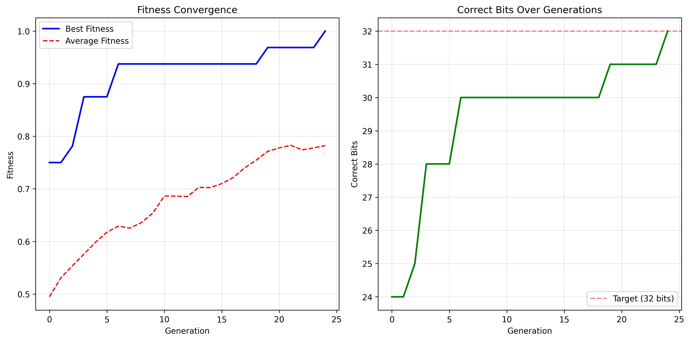
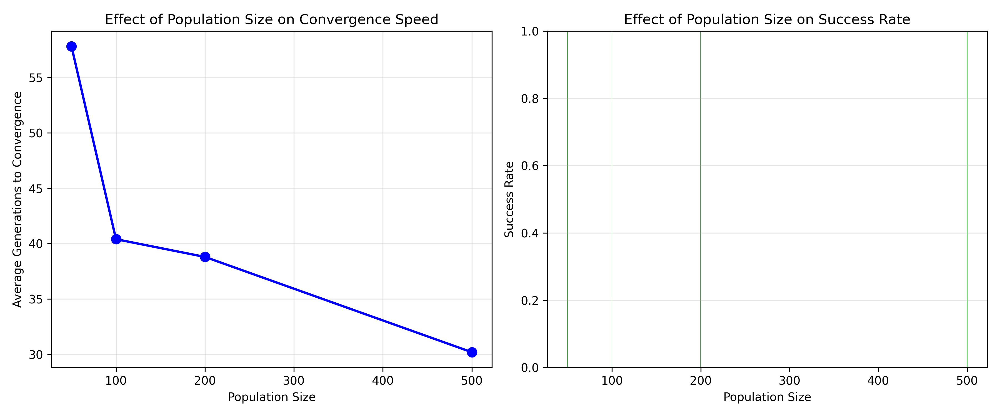
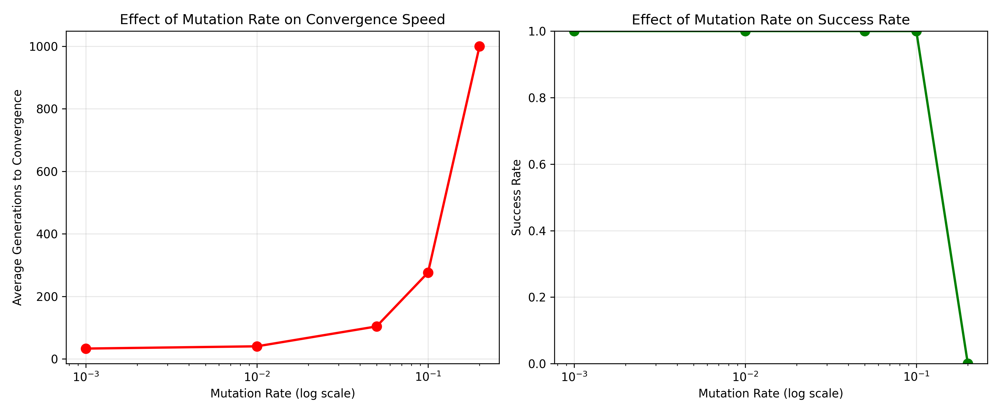
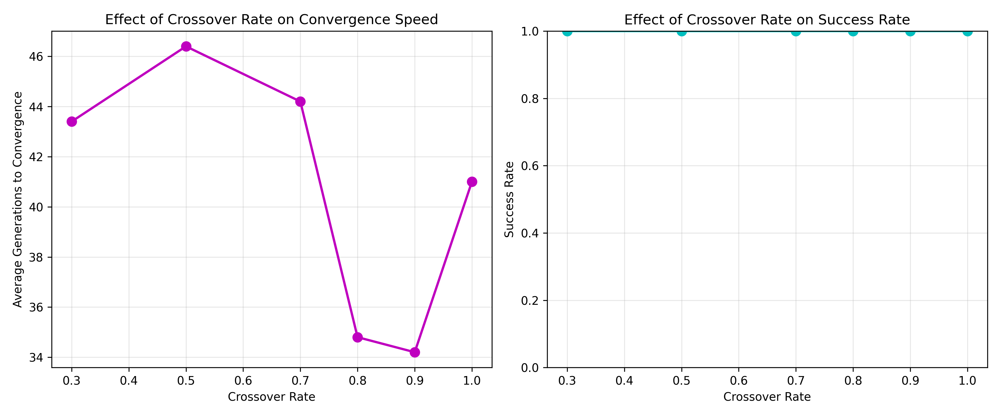

# 🧬 Genetic Algorithm Password Cracker

> An educational simulation that uses a **Genetic Algorithm (GA)** to "crack" a hidden 32-bit binary password by evolving a population of candidate guesses through selection, crossover, mutation, and elitism.

<p align="center">
  
  
  
  
</p>

<p align="center">
  
</p>

---

## 📑 Table of Contents

- [Overview](#-overview)
- [How It Works](#-how-it-works)
- [Key Concepts](#-key-concepts)
- [Features](#-features)
- [Project Structure](#-project-structure)
- [Installation](#-installation)
- [Usage](#-usage)
- [Configuration](#️-configuration)
- [Experiment Results](#-experiment-results)
- [Example Output](#-example-output)
- [Educational Note](#-educational-note)
- [Possible Improvements](#-possible-improvements)
- [Author](#-author)

---

## 🔎 Overview

This project demonstrates how a **Genetic Algorithm** — an optimization technique inspired by natural selection — can search a large space of possibilities to reach a target solution.

The "password" is a randomly generated **32-bit** binary string (over 4 billion possibilities). Instead of brute-forcing every combination, the GA maintains a **population** of candidate guesses and iteratively improves them. Each candidate receives a **fitness** score equal to the fraction of bits it has correct, and the fittest candidates are more likely to pass their genes on to the next generation.

With good parameters the algorithm typically converges on the exact 32-bit target in only a few dozen generations.

---

## ⚙️ How It Works

```
1. Generate a random 32-bit target password.
2. Create an initial population of random candidate guesses.
3. Repeat each generation until the password is found (or the limit is reached):
      a. Evaluate the fitness of every candidate.
      b. Preserve the best candidates (elitism).
      c. Select parents in proportion to their fitness (roulette wheel).
      d. Combine parents to create children (single-point crossover).
      e. Randomly flip bits in the children (mutation).
4. Stop when a candidate matches the target exactly (fitness = 1.0).
```

---

## 🧠 Key Concepts

| Concept | Meaning in this project |
| --- | --- |
| **Chromosome** | A 32-bit sequence representing one password guess. |
| **Gene** | A single bit (`0` or `1`) within a chromosome. |
| **Fitness** | Fraction of bits that match the target (`0.0` – `1.0`). |
| **Selection** | Roulette-wheel selection — fitter individuals are chosen more often. |
| **Crossover** | Single-point crossover combines two parents into two children. |
| **Mutation** | Each bit is flipped with a small probability, preserving diversity. |
| **Elitism** | The best individuals are carried to the next generation unchanged. |

---

## ✨ Features

- ✅ Clean, well-documented, object-oriented GA implementation.
- ✅ Interactive command-line menu (`main.py`).
- ✅ **Single simulation** with fully customizable parameters.
- ✅ **Parameter-tuning experiments** for population size, mutation rate, and crossover rate.
- ✅ **Multiple-run mode** for statistical analysis (success rate, average generations).
- ✅ Automatic **convergence plots** and **CSV exports** of every run.
- ✅ Centralized configuration in `config.py`.
- ✅ A rich set of reusable utilities (Hamming distance, entropy, diversity, etc.).

---

## 📁 Project Structure

```
GeneticAlgorithmAI/
├── main.py                        # Interactive CLI menu (entry point)
├── genetic_password_cracker.py    # Core Genetic Algorithm implementation
├── config.py                      # All tunable parameters in one place
├── run_experiments.py             # Parameter-tuning experiments + plots
├── utils.py                       # Helper functions (conversions, metrics, plotting)
├── requirements.txt               # Python dependencies
├── docs/
│   └── images/                    # Figures used in this README
└── results/                       # Generated plots, CSV data, and logs
```

---

## 🛠 Installation

**Requirements:** Python 3.8+ and `matplotlib`.

```bash
# 1. Clone the repository
git clone https://github.com/YOUR_USERNAME/GeneticAlgorithmAI.git
cd GeneticAlgorithmAI

# 2. (Recommended) create and activate a virtual environment
python -m venv .venv
# Windows
.venv\Scripts\activate
# macOS / Linux
source .venv/bin/activate

# 3. Install dependencies
pip install -r requirements.txt
```

---

## 🚀 Usage

### Interactive menu

Run the main program and pick an option from the menu:

```bash
python main.py
```

```
1. Run single GA simulation with default parameters
2. Run parameter tuning experiments
3. Run multiple simulations for statistics
4. View documentation
5. Exit
```

### Run the algorithm directly

```bash
python genetic_password_cracker.py
```

### Run only the experiments

```bash
python run_experiments.py
```

### Use it in your own code

```python
from genetic_password_cracker import GeneticAlgorithmPasswordCracker

ga = GeneticAlgorithmPasswordCracker(
    population_size=100,
    chromosome_length=32,
    crossover_rate=0.8,
    mutation_rate=0.01,
    elitism_count=2,
    max_generations=1000,
)

result = ga.run()
ga.plot_convergence("convergence.png")
print("Solved in", result["generations"], "generations")
```

---

## ⚙️ Configuration

All defaults live in [`config.py`](config.py) and can be changed in one place:

| Parameter | Default | Description |
| --- | --- | --- |
| `PASSWORD_LENGTH` | `32` | Length of the target password in bits. |
| `DEFAULT_POPULATION_SIZE` | `100` | Number of individuals per generation. |
| `DEFAULT_CROSSOVER_RATE` | `0.8` | Probability of crossover between two parents. |
| `DEFAULT_MUTATION_RATE` | `0.01` | Per-gene probability of a bit flip. |
| `DEFAULT_ELITISM_COUNT` | `2` | Best individuals carried over unchanged. |
| `MAX_GENERATIONS` | `1000` | Generation cap before giving up. |

---

## 📊 Experiment Results

The `run_experiments.py` script sweeps each parameter across several values (5 runs each) and reports both the **average generations to convergence** and the **success rate**.

**Effect of population size**

<p align="center">
  
</p>

**Effect of mutation rate**

<p align="center">
  
</p>

**Effect of crossover rate**

<p align="center">
  
</p>

> A key takeaway: a **small mutation rate** (~0.001–0.01) combined with a **larger population** and a **high crossover rate** (~0.9) gives the fastest, most reliable convergence.

---

## 🖥 Example Output

```
Target Password (Binary): [0, 0, 1, 0, 0, 0, 0, 0, 1, 0, 0, 0, ...]
Target Password (Decimal): 545305490

Starting Genetic Algorithm...
Initial Best Fitness: 0.7500

[SUCCESS] Password found at generation 24
Time taken: 0.04 seconds
```

Every run also writes a convergence plot, a CSV of the fitness history, and a text summary into the `results/` directory.

---

## 📚 Educational Note

This is a **learning project**, not a real cracking tool. It works because the fitness function gives *partial credit* for partially-correct guesses, which turns password guessing into a smooth optimization problem the GA can climb. Real cryptographic password hashing is deliberately designed to leak **no** partial information, so this exact approach does not apply to real systems. The value here is in demonstrating how genetic algorithms explore a search space and converge on a solution.

---

## 🔮 Possible Improvements

- Add alternative selection strategies (tournament, rank) — already listed in `config.py`.
- Add two-point and uniform crossover operators.
- Support arbitrary password lengths and character sets (not just 32 bits).
- Add unit tests and continuous integration.
- Track population diversity over generations to detect premature convergence.

---

## 👤 Author

Created as an educational project exploring genetic algorithms and evolutionary computation.

If you find this useful, consider giving the repository a ⭐.
